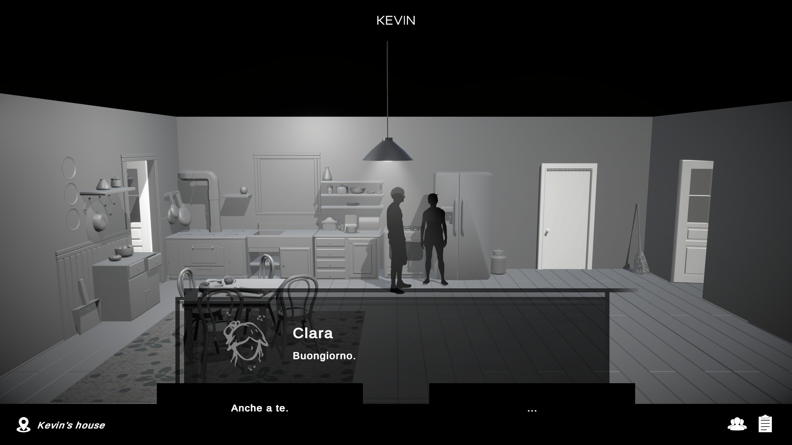
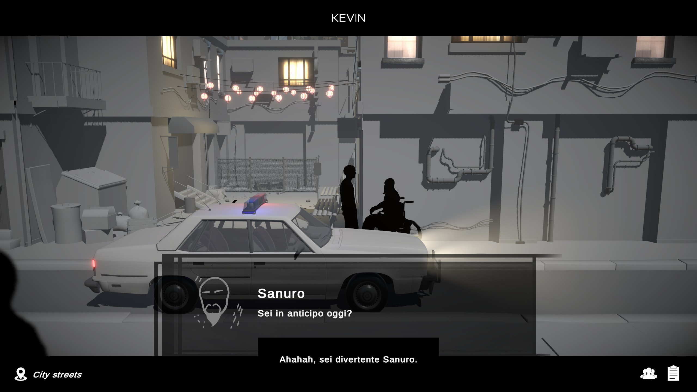

# SoulFlow Patch ITA

   
    Progetto per la traduzione del gioco SoulFlow in italiano.

Il "_progetto_" è nato totalmente a caso e spinto dalla mia curiosità nel riuscire a modificare i testi dei giochi realizzati con Unity, in passato ho già realizzato dei giochi con questo motore di gioco, quindi non mi è del tutto sconosciuto. Dopo un paio di tentativi e "studio", sono riuscito a tradurre parte di un gioco senza far crashare il gioco. In sostanza questa patch è nata come esercizio per comprendere il funzionamento di queste tipologie di traduzioni.

# Immagini Patch

