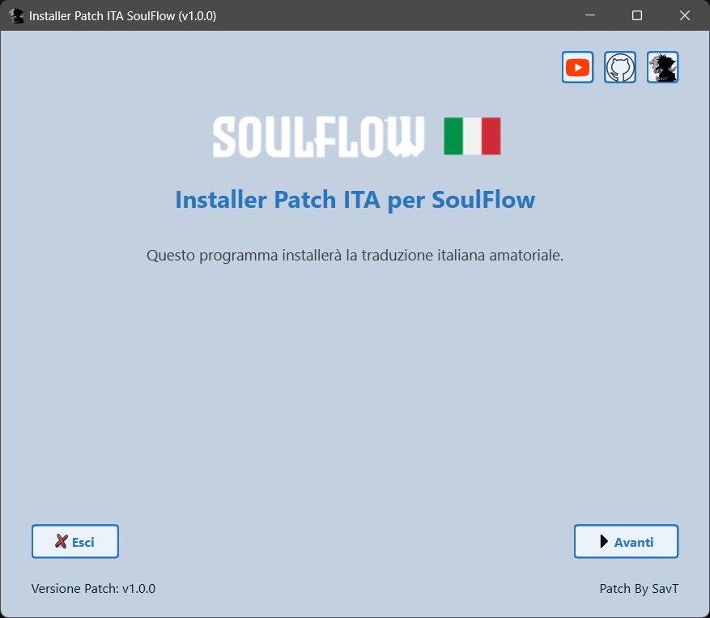
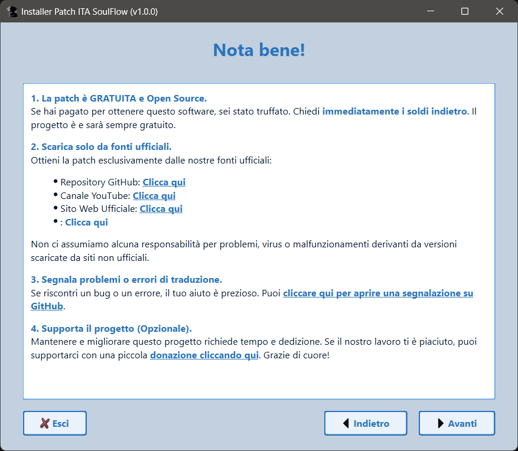
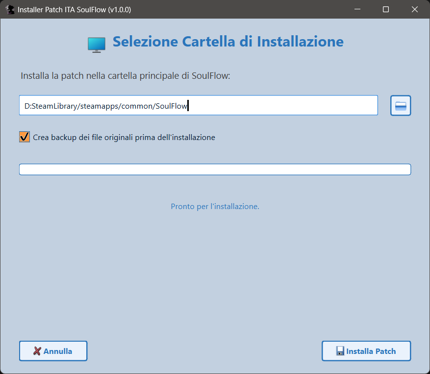

# SoulFlow Patch ITA
<p align="center">
  <br>
    Progetto per la traduzione del gioco SoulFlow in italiano.
</p>

[](https://www.paypal.com/paypalme/verio12)


Il "_progetto_" è nato totalmente a caso e spinto dalla mia curiosità nel riuscire a modificare i testi dei giochi realizzati con Unity, in passato ho già realizzato dei giochi con questo motore di gioco, quindi non mi è del tutto sconosciuto. Dopo un paio di tentativi e "studio", sono riuscito a tradurre parte di un gioco senza far crashare il gioco. In sostanza questa patch è nata come esercizio per comprendere il funzionamento di queste tipologie di traduzioni.

# Immagini Patch


# Come installare la patch

Per installare bisogna selezionare la sezione [Releases](https://github.com/zSavT/SoulFlow-Patch-ITA/releases) su GitHub e selezionare l'ultima versione della patch disponibile. Selezionate l'installer da scaricare in base al sistema operativo scelto ed avviate l'installer.



L'installazione è guidata e semplice, ma in ogni caso basterà sempre cliccare su "_Avanti_". Attendere la verifica dell'integrità dei file della Patch e cliccare successivamente su "_Avanti_".




Successivamente bisogna accettare i termini d'uso e poi nella schermata successiva, selezionare la cartella dove è installato SoulFlow (Di default è impostato il percorso classico) e cliccare su "_Installa Patch_".

# Funzionamento installer

Per poter creare correttamente l'installer bisogna prima di tutto utilizzare ```packager.py``` per poter generare il file criptato della cartella "_data_". Lo script è guidato e bisogna solo indicare il percorso della cartella con le modifiche della Patch ed il nome del file pkg criptato. Nel file "chiave.txt" bisogna inserire la chiave di criptazione scelta.

## Creazione dell'eseguibile

Per poter generare l'eseguibile dello script bisogna utilizzare la libreria "__pyinstaller__" e generare l'eseguibile con i comandi in base al sistema operativo di arrivo.

### Windows

Per generare l'eseguibile dell'installer per Windows, bisogna utilizzare il seguente comando:
```ps
pyinstaller --onefile --windowed --hidden-import=webbrowser --hidden-import=pyzipper --hidden-import=sys --hidden-import=os --hidden-import=platform --hidden-import=traceback --hidden-import=PyQt6 --icon=assets/logo.png --add-data "assets:assets" --add-data "patch.pkg:." --add-data "chiave.txt:." installer.py
```
Nella cartella "_dist_", è presente l'eseguibile.
### Linux (Steam Deck)

Per generare l'eseguibile per Linux, bisogna fare qualche passaggio in più. L'installer è creato tramite la WSL per Windows.
Per prima cosa bisogna creare l'ambiente virtuale per python tramite il comando:
```ps
python3 -m venv venv
```
Se non fosse presente la funzione nell'ambiente, si può installare tramite il seguente comando:
```ps
sudo apt-get install -y python3-venv
```
Con il comando seguente, attiviamo l'ambiente:
```ps
source venv/bin/activate
```
Dopo aver attivato l'ambiente bisogna installare pyinstaller con il comando:
```ps
pip3 install pyinstaller
```
Se pip non è presente nell'ambiente, bisogna installarlo con il comando:
```ps
sudo apt install -y python3-pip
```
Successivamente bisogna installare tutte le librerie utilizzate, presenti nel file requirements.txt, che in ogni caso sono:

- PyQt6
- pyzipper

Successivamente bisogna avviare il comando per la creazione del file eseguibile:
```ps
pyinstaller --onefile --windowed --hidden-import=webbrowser --hidden-import=pyzipper --hidden-import=sys --hidden-import=os --hidden-import=platform --hidden-import=traceback --hidden-import=PyQt6 --icon=assets/logo.png --add-data "assets:assets" --add-data "patch.pkg:." --add-data "chiave.txt:." installer.py
```

Una volta terminato, si può disattivare l'ambiente con il commando:
```ps
deactivate
```

Nella cartella "_dist_", è presente l'eseguibile (la versione per Linux non ha tipo/estensione).

## Dipendenza e ringraziamenti
Si ringrazia

- Per la codifica e la decodifica dei file del gioco, si utilizza il programma sviluppato nella [repo](https://github.com/nesrak1/UABEA) da nesrak1.<br>

## Copyright
This patch does not contain copyrighted material, has no functional autonomy, and you must have your original own copy to apply it.
All game rights, intellectual property, logo/names and movies/images are property of Next in Game and Bluespy Studios.

# Altri progetti di traduzione realizzati da me
[Valkyria Chronicles Patch ITA](https://github.com/zSavT/Valkyria-Chronicles-Patch-ITA)

[Yakuza 4 Remastered Patch ITA](https://github.com/zSavT/Yakuza4-Patch-ITA)

[Yakuza 5 Remastered Patch ITA](https://github.com/zSavT/Yakuza4-Patch-ITA)

[Digimon Story Cyber Sleuth: Complete Edition](https://github.com/zSavT/Digimon-Story-Cyber-Sleuth-Patch-ITA.git)
